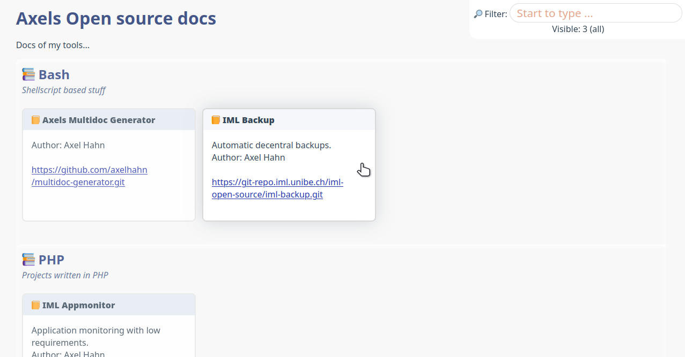

# Overview page

To generate the overview page with all projects the template `./config/overview.template` will be sourced.

This file is used as a bash include. Here are these variables:

* **html_page**
  the html code of the html page.
  You can add links to a custom css or javascript - and must put your own files to the `./public_html/` directory.
  It has these placeholders:
  * `${__page_title__}` - title of the page for h1 and html header
  * `${__page_descr__}` - Hint text
  * `${CONTENT}` - to insert all elements for groups and 

* **html_group**
  start a section for a new group.
  It has these placeholders:
  * `${__group__}` - name of the group
  * `${__groupinfo__}` - Hint text

* **html_element**
  This is the html code per project. The combined html code of all projects will be used as `${__CONTENT__}` in the variable $html_page (see above)
  Placeholders are the following variables:
  * `${__author__}` - description of the project; it is taken from config.json - entry "author"
  * `${__commit__}` - last commit message; it is a automatically read info of author and date from git log
  * `${__descr__}` - description of the project; it is taken from config.json - entry "tagline"
  * `${__group__}` - name of the group
  * `${__label__}` - label for the project; it is taken from config.json - entry "title"; if it is missing it is taken from config/repos.cfg.
  * `${__url_repo__}` - repo url; taken from config/repos.cfg
  * `${__url_doc__}` - url to the generated docs

* **html_group_close**
  optional html code to close a group

Because it is Bash: quote the `"` char with a backslash in the variables.

# Distributed template: boxes

This  is a template to use a table where you get group sections ... and inside a group is one boxes per project.

In th folder ./config/ copy overview.template.boxes.dist to overview.template and start the script *./generate_box.sh*.

```shell
# ================================================================================
#
# HTML TEMPLATE FOR OVERVIEW PAGE
#
# >>> boxes
#
# --------------------------------------------------------------------------------
# 2022-01-19  v0.1  ahahn  init
# 2022-01-20  v0.2  ahahn  added groups and filter
# 2022-01-21  v0.3  ahahn  update filter box: counter of visible items
# 2022-04-01  v0.4  ahahn  add onclick attribute on a box
# 2022-04-01  v0.5  ahahn  css update; add intro text
# 2022-04-03  v0.6  ahahn  add section; add title from json
# 2022-04-05  v0.7  ahahn  darker box header
# ================================================================================


# --------------------------------------------------------------------------------
# html page
# --------------------------------------------------------------------------------
html_page="<!doctype html>
<html>
    <head>
        <title>${__page_title__}</title>
        <style>
            :root{
                --color: #345;
                --colorA: #23a;
                --colorH1: #458;
                --colorH2: #569;
                --colorInfo: #679;
                --colorInput: #c52;
                --colorBoxHead:#fff;
                --bgBody:#f8f8f8;
                --bgBox:#fff;
                --bgBoxHead:#569;
                --bgBoxHeadHover:#347;
            }
            body{background:var(--bgBody); color: var(--color); margin: 1% 3% 2%;}
            a{color: var(--colorA); }
            footer{position: fixed; bottom: 1em; right: 1em; background: rgba(0,0,0,0.05); padding: 0.5em; opacity: 0.3;}
            footer:hover{opacity: 0.6;}
            h1{margin: 0; color:var(--colorH1);}
            h2{margin: 0; color:var(--colorH2); }
            div#filterbox{text-align: center; background: #fff; top: 0; right: 0; padding: 0.5em; position: fixed; border-bottom-left-radius: 1em; z-index: 100;}
            div#filterbox input{font-size: 130%; border-radius: 1em; border: 1px solid #ddd; color: var(--colorInput); padding: 0.1em 0.6em;}
            div#filterbox input:focus{border: 1px solid #abc !important;}
            div.box{float: left; width: 23%; min-width: 20em; border: 2px solid rgba(0,0,0,0.1); border-radius: 0.5em; margin: 0 1% 2em 0; background:var(--bgBox); height: 13em; box-shadow: none; opacity: 1; transition: all 0.3s}
            div.box:hover{box-shadow: 0 0 2em #ccc;border-color: rgba(0,0,0,0.15); cursor:pointer; opacity: 1;}
            div.boxheader{background: var(--bgBoxHead); padding: 0.5em 1em; border-radius: 0.4em 0.4em 0 0 ; transition: all 1s}
            div.box:hover div.boxheader{background: var(--bgBoxHeadHover);}
            div.boxheader a{color:var(--colorBoxHead); font-weight: bold; text-decoration: none;}
            div.boxcontent{margin: 1em;}
            p.groupinfo{color: var(--colorInfo); font-style: italic;  margin: 0;}
            section {display: flow-root; padding: 0.7em; box-shadow: 0 0.2em 0.5em #fff inset; border-top-left-radius: 0.5em;}
        </style>
        <script>
            var idInput='eFilter';
            var idCount='idCount';
            function filter(){
                var sText=document.getElementById(idInput).value;
                var obj = document.getElementsByClassName('box');
                var iCount=obj.length;
                var iVisible=0;
                for (i = 0; i < obj.length; i++) {
                    regex = RegExp(sText, 'i');
                    obj[i].style.display=( !sText || regex.test(obj[i].innerText) )
                        ? 'block'
                        : 'none'
                    ;
                    iVisible+=obj[i].style.display=='block' ? 1 : 0;
                }
                var sVisText='';
                if(iVisible==iCount){ sVisText=iCount+' (all)'; }
                if(iVisible<iCount){ sVisText=iVisible+'/ '+iCount; }
                if(iVisible==0){ sVisText='(none)'; }
                document.getElementById(idCount).innerText='Visible: '+sVisText;
            }
            window.setTimeout('filter()', 20);
        </script>
    </head>
    <body>
        <div id=\"filterbox\">
            🔎 Filter:
            <input type=\"text\" id=\"eFilter\" autofocus onchange=\"filter();\" onkeyup=\"filter();\" onchange=\"filter();\" value=\"\" size=\"20\" placeholder=\"Start to type ...\"><br>
            <span id=\"idCount\"></span>
        </div>
        <h1>${__page_title__}</h1>
        <p>${__page_descr__}</p>

        ${__CONTENT__}

        <div style=\"clear: both; margin-bottom: 5em;\"></div>
        <footer>${__ABOUT__}</footer>
    </body>
</html>
"

# --------------------------------------------------------------------------------
# The replacement for ${__CONTENT__} is multiple concatination of a
# group ...
# --------------------------------------------------------------------------------
html_group="
        <section>
        <h2>📚 ${__group__}</h2>
        <p class="groupinfo">${__groupinfo__}</p>
        <br>
"
html_group_close="
        </section>
"

# --------------------------------------------------------------------------------
# and html snippets per project
# --------------------------------------------------------------------------------
html_element="
            <div class="box" onclick=\"location.href='${__url_doc__}';\">
                <div class="boxheader">
                    📙 <a href=\"${__url_doc__}/\"><strong>${__label__}</strong></a>
                </div>
                <div class="boxcontent">
                    ${__descr__}
                    ${__author__}
                    <br>
                    <a href=\"${__url_repo__}\" target=\"_blank\">${__url_repo__}</a>
                </div>
            </div>

"

# --------------------------------------------------------------------------------
```

The result is something like that:


