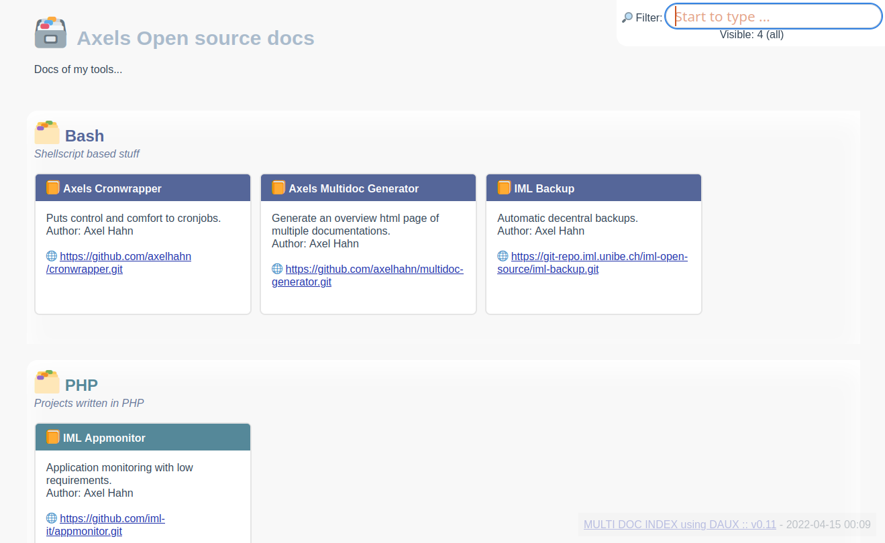

# Multi Doc Generator #

## Description

A bash script to generate a collection of static docs
from a list of repositories (using Daux <https://daux.io/>) or existing folders.

You can configure

* the groups and repositories
* the output html, css, javascript

👤 Author: Axel Hahn\
📄 Source: <https://github.com/axelhahn/multidoc-generator>\
📜 License: GNU GPL 3.0\
📗 Docs: see [www.axel-hahn.de/docs](https://www.axel-hahn.de/docs/multidoc-generator/)

## Features ##

* customizable project list (JSON)
* customizable output: html, javascript, css (2 templates are delived)
* supports groups of projects (by programming language or type)
* project list can be filtered
* add files for webroot or each doc folder of a project

## Demo

Websites using the generator:

* <https://www.axel-hahn.de/docs/>
* <https://os-docs.iml.unibe.ch/>

## Screenshot ##

Generated index.html using the template with boxes (config/overview.template.boxes.dist):

